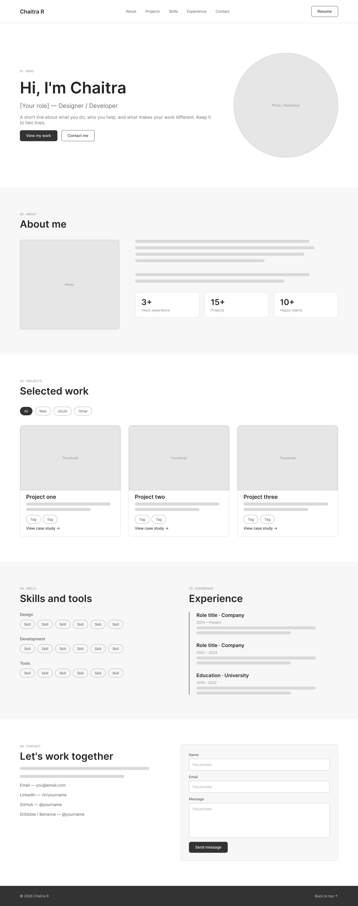
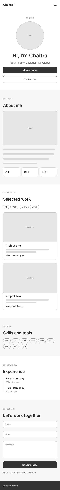

# Chaitra's Portfolio

Personal portfolio website — currently at the **wireframe** stage.

- **Figma wireframes:** [Chaitra Portfolio – Wireframes](https://www.figma.com/design/ogidvcCQIWqzkRgioawmCt)
- **Sections:** Hero · About · Projects · Skills · Experience · Contact

## Wireframe exports

| Desktop (1440px) | Mobile (390px) |
| --- | --- |
|  |  |

## Clickable wireframe

`index.html` is a responsive, clickable version of the wireframe:

- Sticky nav with smooth scrolling to each section
- Hamburger menu on mobile (under 768px)
- Working project filters (All / Web / UI/UX / Other)
- Contact form with validation (demo only — it doesn't send messages yet)

### Test it locally

Download or clone the repo, then open `index.html` in your browser. To test the mobile layout, open your browser's dev tools (F12) and turn on device mode.

## Structure

```
index.html        page markup
css/style.css     wireframe styles + responsive breakpoints
js/main.js        menu, filters, form validation
wireframes/       PNG exports from Figma
```
